<div align="center">



<p>
  
  
  
  
  
</p>

**Point it at a YouTube channel. Get every transcript. Then let your coding agent turn them into a real, cited book.**

</div>

<br>


<br>

## What this is

Two halves that fit together:

1. **A transcript harvester** that survives contact with reality — it enumerates every video on a channel, stores transcripts in MySQL + on disk, and *never redoes finished work*. Kill it mid-run, re-run it, it picks up exactly where it stopped.
2. **A skill** (`skills/youtube-channel-to-book/`) that any coding agent can follow to turn that pile of transcripts into a chapter-wise book where **every claim is traceable to a timestamp** — or it gets deleted before assembly.



<br>

## Setup — 4 commands

```bash
# 1 — clone
git clone https://github.com/devang007/yt-transcripts-downloader
cd yt-transcripts-downloader

# 2 — install
python -m venv .venv && .venv/bin/pip install -e .

# 3 — a database (skip if you already run MySQL 8)
docker compose up -d db          # MySQL 8, correctly configured, on port 3307
cp .env.example .env             # MYSQL_PASSWORD is already devpassword
cp config.yaml config.local.yaml && sed -i 's/port: 3306/port: 3307/' config.local.yaml

# 4 — go
.venv/bin/yt-tx init
```

<details>
<summary><b>Using your own MySQL instead of Docker?</b></summary>

<br>

You need **MySQL 8.0.20+** — not substitutable. `SELECT … FOR UPDATE SKIP LOCKED` is what makes concurrent claiming safe, row-alias upserts need 8.0.20, and `utf8mb4` is mandatory because titles are full of emoji.

```sql
CREATE DATABASE yt_tx CHARACTER SET utf8mb4 COLLATE utf8mb4_0900_ai_ci;
CREATE USER 'yt_tx'@'%' IDENTIFIED BY 'yourpassword';
GRANT ALL ON yt_tx.* TO 'yt_tx'@'%';
```

Then put your host/port/user in `config.local.yaml` and the password in `.env`.

</details>

<br>

## Add a channel, download transcripts

```bash
.venv/bin/yt-tx channels add @lexfridman        # @handle, URL, or channel id
.venv/bin/yt-tx run                             # discover + download. Ctrl-C safe.
.venv/bin/yt-tx stats                           # how far it got
```

Or drive the whole thing from the browser — start/pause/stop, every knob, live logs, and transcripts browsable channel by channel:

```bash
.venv/bin/yt-tx serve                           # http://127.0.0.1:8000
```

Then export the corpus your agent will read:

```bash
.venv/bin/yt-tx export --out data/export --format txt --per-video
```

> **Tip:** a YouTube Data API key is optional but makes enumeration ~50× cheaper. Drop it in `.env` as `YOUTUBE_API_KEY`. Without one it falls back to yt-dlp and still works.

<br>

## Now make the book

Open the repo in **your favourite coding agent** — Claude Code, Cursor, Codex, Cline, whatever — and give it this prompt:

```text
Read skills/youtube-channel-to-book/SKILL.md and follow it end to end.

Transcripts:  data/export/
Project dir:  books/_<creator>-project/
Subject:      <creator name> — everything they teach about <topic>

Rules I care about:
- Work phase by phase, writing every phase's output to disk before moving on,
  so a context reset never loses progress.
- Every substantive sentence in a chapter must carry an evidence-card ID that
  resolves to a real timestamped card. Run the verify script and delete any
  sentence that doesn't. A claim without a card is a guess.
- Organise by concept, not by upload date. Flag it when the creator's method
  changed over time.
- Show me the outline and get my sign-off before you draft any chapters.
```

The agent does the rest: ingest → skim every video → build a topic ledger → outline → deep-extract only what the chapters actually cite → draft → verify → build `book/book.html` and a PDF.

<div align="center">

`412 transcripts` → `9,481 evidence cards` → `18 chapters` → **one book you can hand to someone**

</div>

<br>

## Why it doesn't fall over

|  | |
|---|---|
| **Resumable by construction** | `videos.status` is the single source of truth. Finished work is never re-attempted; every phase of the book pipeline writes to disk. |
| **Concurrency that can't collide** | `FOR UPDATE SKIP LOCKED` leases. A worker killed mid-batch just lets its lease lapse. |
| **A block is a fetcher condition, not a video condition** | When YouTube refuses your IP, nothing gets marked broken. The circuit breaker pauses everything and cools down 5→10→20→40→60 min. One bad afternoon can't poison thousands of rows. |
| **No hallucinations, mechanically** | Fidelity isn't an instruction to the model — a script checks that each citation resolves to a real extracted card, and unsupported sentences get cut. |
| **Durable writes** | Transcript file is fsynced *before* its database row commits. An orphan file is harmless; a row pointing at a missing file is corruption. |

<br>

## Where to go next

- **[docs/REFERENCE.md](docs/REFERENCE.md)** — every command, the state machine, quota behaviour, operating notes at scale, architecture, tests.
- **[skills/youtube-channel-to-book/SKILL.md](skills/youtube-channel-to-book/SKILL.md)** — the book pipeline in full: card schema, extraction rules, verification.
- **[books/](books/)** — a finished example, built from a real channel.

<br>

<div align="center">

Built because a 300-video channel is 3–8 million tokens, and nobody is going to watch it.

**MIT** · PRs and issues welcome · ⭐ it if it saved you a weekend

</div>
